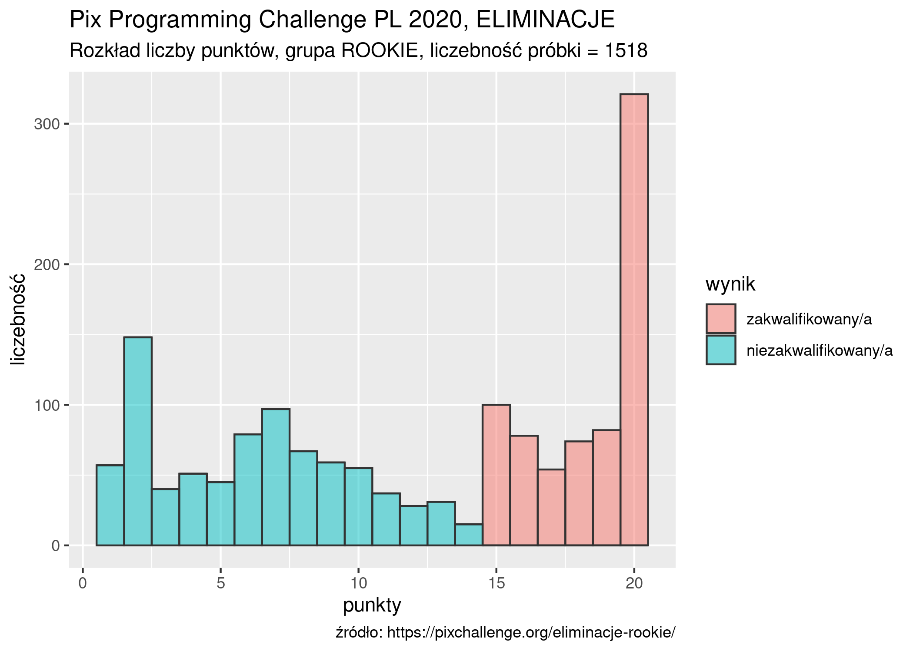
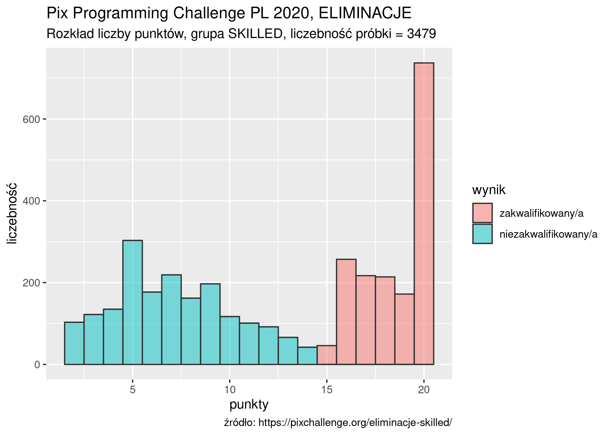
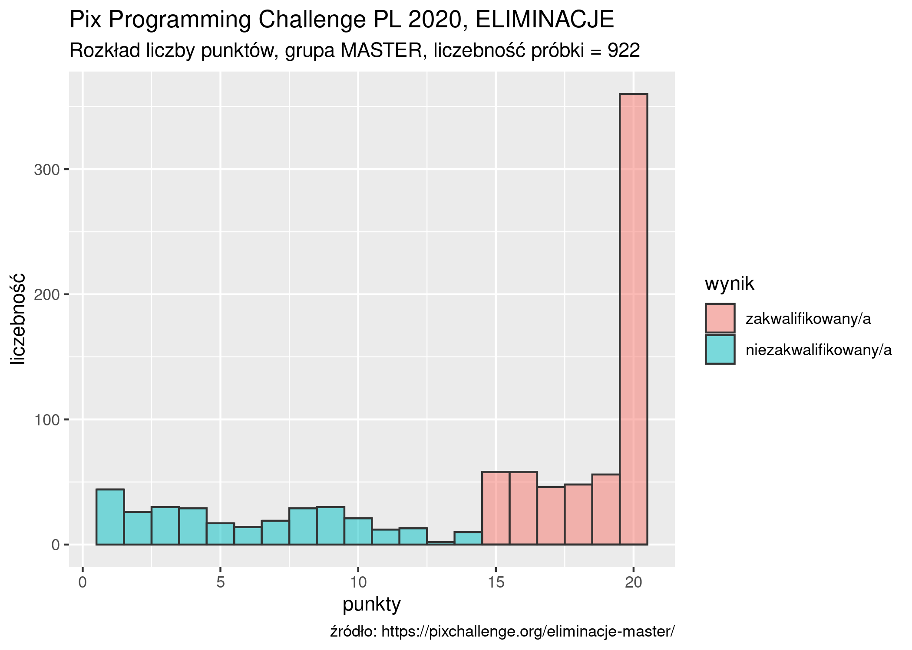
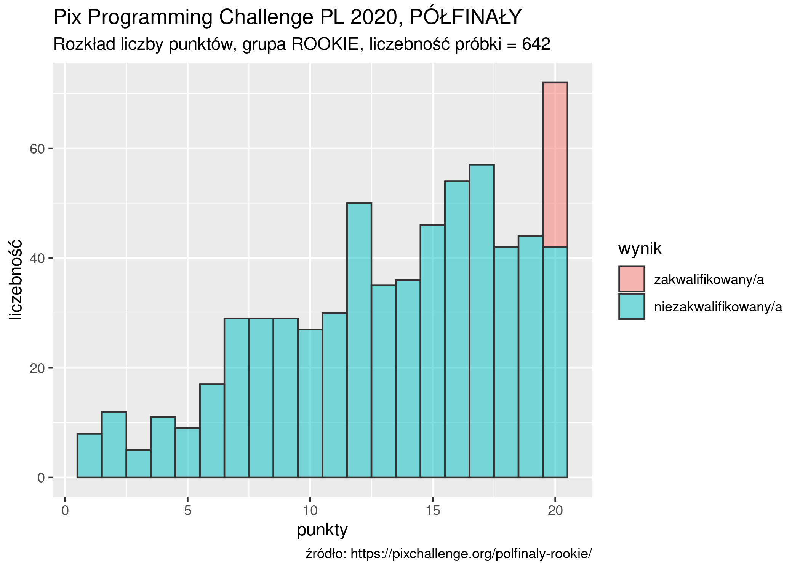
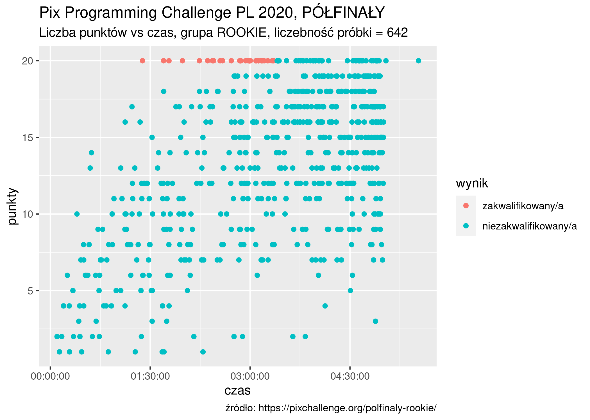
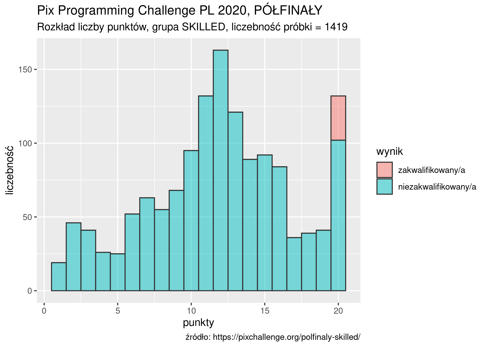
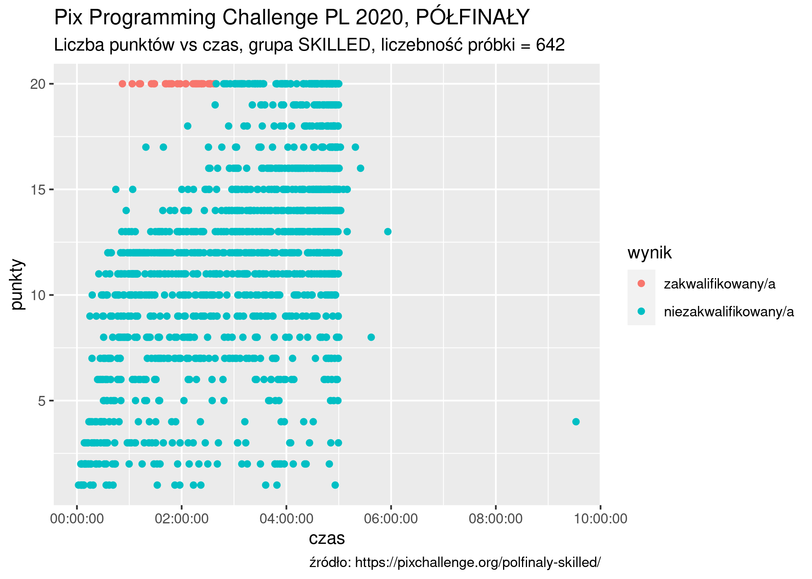
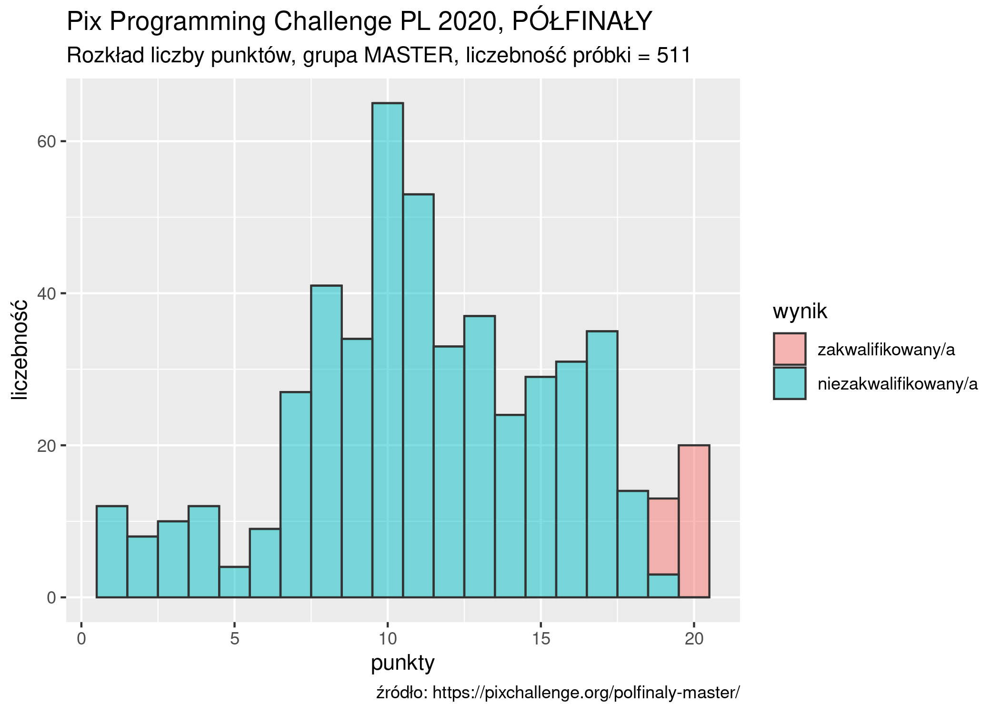
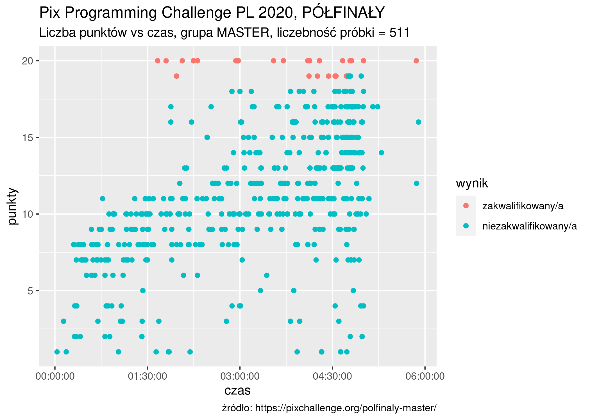

# Pix Programming Challenge PL 2020

Paweł Sakowski, `pawelsakowski@gmail.com`

## ELIMINACJE

### grupa ROOKIE

### grupa SKILLED

### grupa MASTER

## PÓŁFINAŁY

### grupa ROOKIE

### grupa SKILLED

### grupa MASTER

